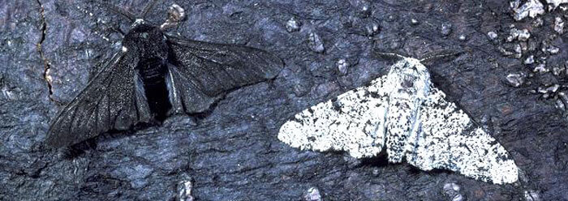

# :butterfly: Evolution of Moths

**Evolution of Moths** establishes an intimate relationship between human ability to solve problems and natural processes. It is invaluable to observe how nature is able to find the best way to continue its ecosystem.

**Evolution of Moths** presents a strategy based on evolutionary biology with the purpose of offering solutions to real problems, whether scientific, technological or business. Operating on the logic of genetic algorithms, it is possible to validate by observing in a simplistic model the adaptation process of the moths during the industrial revolution in England.

This platform simulates a set of genes trying to adapt to its surroundings by basic natural selection concepts. The set of genes belongs to a fictional species which the ones with the closest pigmentation to the environment have better camouflage so they’re less likely to be tracked by its predator. Thus, they manage to live until reaching sexual maturity and pass down their genes.

The platform keeps running continuously and all viewers can see the same evolution taking place.

  
  Source: Middle East Medical

The evolutionary process is paced by imposing an interval of approximately 4 seconds between each generation and it involves a population of 15000 individuals trying to adapt to the color of their environment, which is defined in a random and independent way. Each of the 60 hexagons represents an individual who stands at a relevant point on the adaptation scale which ranges from the most to the least adapted.

After the 40 generations defined for each randomly proposed environment, it is clear that most individuals representing their range in the adaptation scale have in their genetic structure genes that approximate the color of the environment. This is because the genes responsible for defining its color have already become predominant in that population.

**Evolution of Moths** wants to influence developers to consider natural selection techniques for problem solving, allowing solutions to adapt to the environment in which they coexist.

### A little bit about the history of peppered moth evolution

There was a time before the industrial revolution in England, when it was common to find these moths with a clear and peppered appearance.

Variations of this moth in dark color, was first identified in 1848, close to Manchester, and increased in frequency until constituting more than 90% of the population in areas considered polluted in the middle of the 20th century.

  
    Source: ICR (Institute for Creation Research)

The environmental protection practices implemented around 1970 made the frequency of the dark colored moths in the 90's reduce drastically to less than 10% of the population.

During the 50's, Kettlewell explained the change in frequency caused by visual bird hunting. The dark colored moths hid on tree trunk in polluted areas, where soot killed the lichen. In other regions, the whiter moths hid in low pollution areas.

Since evolution is defined by change in frequency of inherited characteristics over time, the _Biston betularia_ dark frequency varied as result of the beggining of Insdustrial Revolution and later by Anti Poluttion Laws.

## License

[MIT License](LICENSE)
